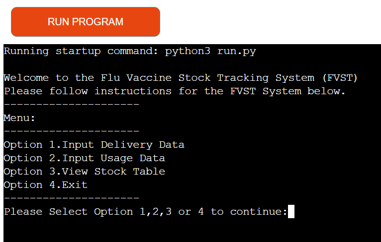

# PythonVproject PP3

PythonVproject is a Flu Vaccine Stock Tracking System designed to run on the render platform. This system is aimed at helping any medical practice that deals with vaccines to track their stock.

[Visit My Website](https://pythonvproject.onrender.com/)

## Disclaimer:
1. This project used the Code Institute student template for deploying my third portfolio project using Python command-line. The last update to the template file was: **May 14, 2024**.
2. This application is not all comprehensive. There is more development to be done. Due to the scope of this project and time constraints I am satisfied with the current development and features which satisfy the project goals.

## Content 
- [Purpose](#purpose)
- [User Experience](#user-experience)
- [Code logic](#code-logic)
- [Flow chart](#flow-chart)
- [Data storage](#data-storage)
- [Features](#features)
- [Future features](#future-features)
- [Technologies used](#technologies-used)
- [Python Packages used ](#python-packages-used)
- [Testing](#testing)
- [User Testing](#user-testing)
- [Development and Existing bugs](#development-and-existing-bugs)
- [Deployment and Development](#deployment-and-development)
- [Credits ](#credits)
- [Acknowledgements](#acknowledgements)

-------------------------------------------------------------------------
## Purpose
 This Flu Vaccine Stock Tracking (FVST) System is aimed at helping any medical practice that deals with vaccines to track their stock. The users can see their stock, record the deliveries and usage and know how much stock they have in date or expired. This system is aimed to help manage/trace orders and usage for reporting purposes like for example statistics to the health department. These type of systems are invaluable to organisations like the HSE in the world. Current systems in place may lack important validation rules and therefore rendering statistical data of vaccinations incorrect.

## User Experience
As the creator of the application and user I needed and wanted to make sure of the following:
* the user to find the system easy to navigate and easy to understand
* the user to have instructions and limitation information where necessary
* the user to be aware of steps and validation steps for when incorrect data was entered
* maintain the user informed along every step
* for data to be visible when it was requested
* ability to exit the application
* easy to navigate menu

The user of this application will be a person in the medical sphere that must record deliveries and usage of vaccines. This way at the end of the month they have information that could be passed to a main institution and statistical information pulled from the data available. The application is to be very easy to use and not tedious. Steps to be skipped if necessary.

## Code logic

First I had to understand what a user would need and how it would actually work to calculate a stock.
For this I used a google sheet that was to collect the deliveries and usages and then these data points would be used to calculate the stock. This google sheet was paramount to the design of how the application would work and the logic from how it should operate in a manual setting and then was applied/transferred to the application. This step was crucial in the design.

## Flow chart

I drew this chart to understand and clarify how the program was going to work. This design on flow chart helped ne comprehend and guide me to bring the application to fruition. A clearly defined flow helped code and have the correct flow.
Both the google sheet flow calculation and the flow chart design paved the way for the application to function correctly.

## Data storage
The data is stored in a google sheet. All data entered gets saved down and then calculations are made from this stored data. It is imperative for data to be stored in order to calculate the stock. It is also vital that data is correctly entered. Without good data no application could perform adequate steps.

## Features 
The start of the program it explains clearly what the system is and what it is for.
It also gives clear instructions by options needed for the system to work.

This was the initial menu but it was too long so it was improved.

The main menu asks for an option to be chosen and it is clear that an option must be chosen to proceed.

Instructions are also available as you go along and validation is taking place along the way to make sure good data is entered.

Data validation transpires along the input of data to make sure the data is correct.

If the stock used is not in the delivery or if the used exceeds delivery the application lets the user know.

The user can see the stock table. I think it is important for the user to be aware of the contents they have in the practice in order to plan for next order or riddance of expired stock should they have it on the shelves.

The user can just exit if they changed their mind about using the system or they were interrupted. 

## Future features
I had in mind something more simple to be honest but it became more complex as it went along.
I feel this system needs more development.
The expiry date calculation should be properly thought out and a more complex logic developed.
I feel the system could really improve as it does not feel smooth.
It feels a annoying once I use it again and again, therefore more refinement is merited.
A future feature could be developed that if a delivery has been fulfilled and all stock is used then not let the user try to add more usage.
Another feature could be not to allow same batch number for more deliveries for that batch number.

## Technologies used 
* Draw.io for making charts
* HTML5 for added structure provided by code institute template
* CSS for added styling provided by code institute template
* Python to provide the functionality to the system
* Google sheets to store data
* Google API services for connectivity and functionality
* Gitpod used to create the code and content and repository
* Github to store the repository 

## Python packages used
* gspread - to manipulate data in google sheets
* dateime - to manipulate dates 
* tabulate to present table

## Testing 
The CSS, HTML, Javascript were provided by the Code Institute for this project, thus did not test for these.
The code I tested was the python code for this project on https://pep8ci.herokuapp.com/ to validate my code

Received a couple of white space errors such as:
* W291(trailing whitespace).
* W293 (blank line contains white space).
* Received E501 error (line too long).
* Received E302 error (expecting white line but 0 found).
I fixed the white spaces but the 'long lines' I left in the code as it is not necessary to reduce
The code works in this project as is and long lines are needed.
There is a known rule among coders that "if it works, don't touch it" allegedly.

## User Testing 
Requested several people to try the application. Several bugs in the logic were discovered.
- usage could exceed delivery - bug fixed
- dates could be in the past - bug fixed
- dates could be in the future - bug fixed
- quantities could be a minus number - bug fixed
- the main menu was tedious as one had to go through entire process and could not skip steps - bug fixed
- batch number could be a negative number - bug fixed 
- quantity allowed to order was missing - bug fixed

## Code Testing
Had to go through each function to test manually in order to see if each line of code did what it was supposed to.
There was a lot of back and forth.
Had to choose the options yes/no for each delivery and usage and try inputting bad data.
Had to input batch numbers right and wrong, also dates good and bad formats and same for vaccine names, had to test by trying good and wrong vaccine names.
Had to go through each step and see if the code worked as it should have per each case given.
Also had to manually test each menu option and make sure the print statements said the correct action and that each option went to the correct function.
It was a tedious task to check each part individually and it consumed a lot of time.
Once tested and wrong things appeared had to go fix those bugs of which were many.

#### Development and Existing bugs
The code was going from simple step to step to more complex logic. It started simple and then I came across many bugs as stated above. These bugs were only visible after user testing and requesting individuals to play with the application and think of possibilities that I did not think about. Even with these bugs there is at least one bug that I have thought about but do not have the time frame to cover in this project. The delivery date and expiration date is far more complex than just adding 30 days to the delivery. In fact, my logic adds 30 days to the last delivery but it does not account for the old delivery to be sure out of date and therefore expired. More testing and more development is required to perfect this application and more complex logic is required to cover these refined details on expiration.

There was another bug in the system that is fixed now but the bug was to do with the usage. If the usage was entered again at a later stage for a particular batch and there were already used quantities present in the system, it did not recognize the present usage to take into account for that vaccine used and it calculated with minuses in the stock left over. Obviously this would have been incorrect as you cannot use more than you had delivered.
This is to be fixed at a later time outside the scope of this project.

## Deployment and Development
#### Deployment on Render
I deployed my project on Render as I had issues with Heroku. 
Created Environment variables in Render in applicable Settings.
1. 'Port'
2. 'Nodejs`
3. 'Credentials'
4. 'Python version'
Had credentials `CREDS` and pasted the JSON into the value field.
Connected my GitHub repository and deployed.

For deployment I needed to make sure the python version was the same in both entities, gitpod and render.
I also had to make sure I followed the instruction available on the settings as per screenshot below.

I had to make sure to enter all the environment variables that were not present in the documentation of code institute. Other fields were needed.
This knowledge could only be acquired through troubleshooting and googling or using open AI to learn what was wrong and how to overcome it.

The creds file instructions was followed and entered on render.

After many fails the deployment finally succeeded as per screenshots. Logs were available where I could see the progress of the deployment.
Clearing cache and deployment in the menu was a button I pressed many times.

Successful deployment on render.com

#### Guidelines followed:
- Cloned template as per Code Institute  request and used for project as instructed
- Code placed in the `run.py` file
- Dependencies placed in the `requirements.txt` file
- Added to the `requirements.txt` file as required per project
- Did not edit any other files or code may not have deployed properly
- Edited code to deploy on render
- Ignored too long error E501

#### Issues on deployment 
Encountered many issues on the render app but was able to figure it out eventually.
Used the documentation given by student services but not all the information was in the instructions.
Figured out other environmental variables had to be introduced through a lot of troubleshooting but I also used the help acquired for the Love Sandwiches run through and was able to apply the knowledge acquired there to this project.

#### Connecting GCP/API
To had the API connectivity instructions and I followed those from previously learned material.
Used the Google Drive API and Google Sheets API.
Went to the google platform and connected while using the google sheets and the goodge drive api services with created credentials.

## Credits
Code Institute code template to create this project.
Code Institute student support to troubleshoot a lesson project and used this knowledge to apply to this project.
Code Institute lessons for connecting API.
Google and Open AI for problem resolution and code troubleshooting.
Advice from my mentor Richard Wells on menu creation.
My job and the code institute "love sandwiches project" for the idea of a Flu Vacstock system.

## Acknowledgements 
My mentor Richard Wells and the student support staff for render knowledge from lessons that I used to deploy.

Dia LeDesma 2024
